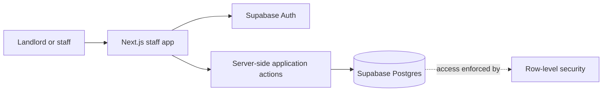

# Dormio V1 High-Level Architecture

**Status:** Proposed direction  
**Related document:** [Dormio V1 Product Requirements](dormio-v1-scope.md)

## Recommendation

Build V1 as a modular monolith: one Next.js staff application backed by Supabase Auth and Supabase Postgres. Keep the business logic and data in the existing stack; V1 does not need microservices or separate infrastructure.

## High-Level System

## Responsibilities

- **Staff application:** Protected workflows for rooms, renters, contracts, billing, money, maintenance, and the monthly overview.
- **Application actions:** Server-side operations for business changes. Multi-step workflows, such as moving a renter in and creating the first bill, should succeed or fail together.
- **Supabase Auth:** Staff sign-in only. Renters do not have accounts or a renter-facing app in V1.
- **Supabase Postgres:** Authoritative store for operational and financial records. Row-level security protects access to landlord data.

## Proposed V1 Application Structure

- Keep room operations, renter contracts, billing and payments, income and expenses, services, and maintenance as feature areas in the same Next.js application and deployment.
- Use Server Components and server-side queries for reads. Route business mutations through server-side application actions that validate input and enforce workflow rules.
- Render the protected shell and navigation without waiting for noncritical data. Stream data-dependent sections with route or component loading boundaries and useful skeletons.
- Prioritize the data needed for the page's main task, start independent reads in parallel, and defer below-the-fold sections or optional heavy client components.
- Use a Postgres transaction or database function for multi-record workflows, such as moving a renter in and creating the first bill.
- Manage schema changes with SQL migrations and enforce data access with row-level security. Never expose the Supabase service-role key to the browser.
- Build monthly balances and summaries as queries over authoritative records. V1 uses manually entered monthly charges, so scheduled billing jobs and a separate reporting store are unnecessary.

## Data Ownership

- The landlord account owns all V1 records.
- Scope server-side queries and mutations to that landlord account, and enforce the same ownership boundary with row-level security.
- V1 does not introduce a separate organization or workspace ownership model.

## Occupancy Model

- A room has at most one active contract, linked to one main renter.
- The main renter may live with other residents. Dormio stores no individual records for those residents; the contract stores an anonymous resident headcount.
- Per-person service charges use the headcount recorded on the active contract for the first day of the billing month.

## Proposed Domain Model

- **Room:** landlord-owned room with rent and deposit defaults, plus default service settings. Proposed: derive Available, Reserved, or Occupied from its active reservation or contract; maintenance does not affect this state.
- **Renter:** landlord-owned primary renter record with name and phone number.
- **Reservation:** links an available room to a renter and intended move-in date. Deposit receipts are recorded against the reservation; cancellation makes received funds forfeited-deposit income.
- **Contract:** links one room and one primary renter. It snapshots the room terms, contract overrides, move-in date, and anonymous resident headcount. A move-in from a reservation credits reservation deposits toward the contract deposit due.
- **Services:** a service catalog with room defaults and contract-specific settings. Usage readings belong to a service and billing period and remain correctable until the charge is posted.
- **Monthly bill:** groups rent, service, and any remaining refundable deposit due for a contract and period. Preserve the rates, headcount, and meter readings used to calculate each line.
- **Payments:** renter-level records with amount, date, and method; they reduce the combined renter balance without allocation to individual lines.
- **Other income and expenses:** separate dated, categorized records; expenses may optionally link to a room.
- **Maintenance issue:** room-linked issue record kept independent from reservations, contracts, and room availability.

## Proposed Relational Shape

This is a candidate table grouping, not a committed schema.

- **Reference data:** `rooms`, `renters`, and `services`; `room_service_defaults` assigns a service and its billing terms to a room.
- **Occupancy:** `reservations` link rooms and renters; `reservation_deposit_receipts` record deposit payments. `contracts` link one room and one primary renter, with copied terms and headcount; `contract_services` stores service settings for that contract.
- **Billing:** `bills` group a contract's charges by month, and `bill_lines` represent rent, services, and deposit due. `meter_readings` store period readings for contract services. Posted bill lines snapshot calculation inputs so history is stable.
- **Collections and income:** `payments` belong to a renter and are not linked to individual bill lines. The renter balance is derived across their posted charges and payments. `income_entries` record other income, forfeited reservation deposits, and rent/service income when the renter balance clears.
- **Expenses and maintenance:** `expenses` are dated and categorized with an optional room link; `maintenance_issues` belong to a room.
- **Constraints:** allow at most one active occupancy per room: an active reservation or an active contract, never both. Allow at most one bill per contract per month. Derive room status instead of maintaining a second, independently editable status value.

## Proposed Workflow Boundaries

1. Reserving or canceling a room updates the reservation lifecycle and room availability; cancellation records any received reservation deposit as forfeited income.
2. Moving in creates the contract and first bill together, including service charges and the remaining deposit due after reservation-deposit credit.
3. Monthly billing captures rent and service charges, with usage readings corrected before the relevant charge is posted.
4. Payments update the renter's combined balance. Income summaries combine qualifying paid rent and services with other income; expenses are reported separately.
5. Maintenance is recorded and updated independently, without changing room availability.

## Paid Status and Income Recognition

- Paid status is based on the renter's combined balance across posted charges and renter-level payments; payments are not allocated to individual lines.
- Reject a payment greater than the renter's current outstanding balance. V1 does not carry overpayments as credit.
- When the combined balance reaches zero, recognize the eligible rent and service charges in that settlement month, categorized by their original charge categories.
- Refundable deposits remain excluded from income; reservation deposits become income only when forfeited.

## Architectural Principles

- Keep business rules on the server rather than duplicating them in the client.
- Treat persisted business records as authoritative. Derive balances, room status, and monthly summaries from those records where practical.
- Preserve historical contract terms and bill details so changes to room defaults do not rewrite existing agreements or charges.
- Use database transactions or database functions for workflows that update several related records.
- Keep maintenance independent from room availability and occupancy.

## Delivery Stages

1. Establish the protected app shell, authentication, and data-access policies.
2. Build the core room, renter, service, reservation, and contract workflows.
3. Add monthly billing, usage readings, payments, expenses, and income reporting.
4. Add maintenance tracking and complete the monthly overview.

## Next Design Step

Translate this proposed domain model into relational tables, constraints, migrations, and row-level security policies.
