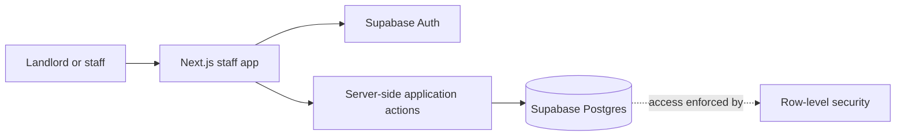

# Dormio V1 High-Level Architecture

**Status:** Proposed direction  
**Related document:** [Dormio V1 Product Requirements](dormio-v1-scope.md)

## Recommendation

Build V1 as a modular monolith: one Next.js staff application backed by Supabase Auth and Supabase Postgres. Keep the business logic and data in the existing stack; V1 does not need microservices or separate infrastructure.

## High-Level System

## Responsibilities

- **Staff application:** Protected workflows for rooms, renters, contracts, billing, money, maintenance, and the monthly overview.
- **Application actions:** Server-side operations for business changes. Multi-step workflows, such as moving a renter in and creating the first bill, should succeed or fail together.
- **Supabase Auth:** Staff sign-in only. Renters do not have accounts or a renter-facing app in V1.
- **Supabase Postgres:** Authoritative store for operational and financial records. Row-level security protects access to landlord data.

## Proposed V1 Application Structure

- Keep room operations, renter contracts, billing and payments, income and expenses, services, and maintenance as feature areas in the same Next.js application and deployment.
- Use Server Components and server-side queries for reads. Route business mutations through server-side application actions that validate input and enforce workflow rules.
- **Confirmed V1 write path:** Next.js Server Actions call authenticated Postgres functions for mutations; multi-record workflows execute atomically in those functions.
- **Confirmed V1 privilege boundary:** protected write functions use `SECURITY DEFINER`, set a fixed safe `search_path`, derive the caller from `auth.uid()`, and explicitly verify ownership for every affected row. Grant authenticated users execute access to these functions, not direct write access to protected tables. Keep RLS enabled for table access, and do not assume RLS alone protects code inside a definer function.
- Render the protected shell and navigation without waiting for noncritical data. Stream data-dependent sections with route or component loading boundaries and useful skeletons.
- Prioritize the data needed for the page's main task, start independent reads in parallel, and defer below-the-fold sections or optional heavy client components.
- Manage schema changes with SQL migrations and enforce data access with row-level security. Never expose the Supabase service-role key to the browser.
- Build monthly balances and summaries as queries over authoritative records. V1 uses manually entered monthly charges, so scheduled billing jobs and a separate reporting store are unnecessary.

## Data Ownership

- The landlord account owns all V1 records.
- Scope server-side queries and mutations to that landlord account, and enforce the same ownership boundary with row-level security.
- V1 does not introduce a separate organization or workspace ownership model.

## Environment and Release Strategy

- **Confirmed V1 constraint:** use one hosted Supabase project; do not require a separate hosted staging environment or Supabase branch plan.
- **Confirmed connection approach:** the Next.js app uses the hosted Supabase project directly through Supabase clients, including server-side clients; V1 does not run a local Supabase service or add a separate backend API.
- Keep schema changes in reviewed, source-controlled SQL migrations. Before real financial data is entered, test migrations, database functions, and row-level security against synthetic data in the hosted project, and run the application lint/build checks.
- Once the hosted project contains real financial data, limit checks against it to non-destructive smoke tests; do not seed test data or run destructive test cases there.
- **Confirmed deferral:** formal backup/recovery targets and dedicated recovery procedures can wait until the app has more users. Retain a plan-appropriate backup or export before production migrations.
- Before applying a production migration, verify the available backup/restore path for the current Supabase plan. Apply migrations deliberately, then run non-destructive production smoke checks. Do not run destructive tests or seed test data in production.

## Occupancy Model

- A room has at most one active contract, linked to one main renter.
- The main renter may live with other residents. Dormio stores no individual records for those residents; the contract stores an anonymous resident headcount.
- Per-person service charges use the headcount recorded on the active contract for the first day of the billing month.

## Proposed Domain Model

- **Room:** landlord-owned room with rent and deposit defaults, plus default service settings. Proposed: derive Available, Reserved, or Occupied from its active reservation or contract; maintenance does not affect this state.
- **Renter:** landlord-owned primary renter record with name and phone number.
- **Reservation:** links an available room to a renter and intended move-in date. Deposit receipts are recorded against the reservation; cancellation makes received funds forfeited-deposit income.
- **Contract:** links one room and one primary renter. It snapshots the room terms, contract overrides, move-in date, and anonymous resident headcount. A move-in from a reservation credits reservation deposits toward the contract deposit due.
- **Services:** a service catalog with room defaults and contract-specific settings. Usage readings belong to a service and billing period and remain correctable until the charge is posted.
- **Monthly bill:** groups rent, service, and any remaining refundable deposit due for a contract and period. Preserve the rates, headcount, and meter readings used to calculate each line.
- **Payments:** renter-level records with amount, date, and method; they reduce the combined renter balance without allocation to individual lines.
- **Other income and expenses:** separate dated, categorized records; expenses may optionally link to a room.
- **Maintenance issue:** room-linked issue record kept independent from reservations, contracts, and room availability.

### Initial Relational Schema Draft

The initial schema and core workflow functions are drafted in source-controlled migrations and remain unapplied. The model below documents their intended relationships; both migrations still need PostgreSQL-level validation against synthetic data before real financial data is entered.

### Core and occupancy

- `rooms`: `id`, `owner_id`, name/number, default monthly rent, and default deposit. Do not store an editable status; derive it from active reservation or contract records.
- `renters`: `id`, `owner_id`, required name and phone number.
- `reservations`: `id`, `owner_id`, `room_id`, `renter_id`, intended move-in date, and lifecycle state (reserved, canceled, converted).
- `contracts`: `id`, `owner_id`, `room_id`, `renter_id`, optional source reservation, move-in date, current monthly rent, deposit amount, anonymous resident headcount, and active/ended state. V1 updates current terms in place; changes affect future bills only, while posted bill lines preserve the terms used previously.
- `contract_terminations`: one record per ended contract, with actual move-out date and confirmation timestamp. The contract-end bill references this record.

### Services and billing

- `services`: landlord-owned service catalog.
- `room_service_settings`: unique room/service pair with billing basis and default rate.
- `contract_service_settings`: unique contract/service pair copied from room defaults and overridable for the contract. V1 updates the current settings in place; posted bill lines preserve the rates previously used.
- `meter_readings`: contract service and billing period, start/end values, and correction/finalization state. Keep readings editable until the charge is posted.
- `bills`: contract, type (`monthly` or `contract_end`), billing period when monthly, due date, and draft/posted state.
- `bill_lines`: bill, line type, amount, category/service reference, and calculation snapshots (rate, headcount, usage, and meter readings). Show deposit due and application in the contract-end statement. Show any remaining deposit as a separate refund due, excluded from the renter balance; only an actual refund is a cash transaction.

### Money and operations

- `payments`: renter, amount, actual payment date, and method. These remain renter-level with no landlord allocation to individual bill lines.
- `deposit_transactions`: append-only deposit receipt, application, forfeiture, and refund events linked to their payment, reservation, or contract. **Confirmed V1 direction:** this ledger is the source of truth; derive held/refundable deposit from its events instead of storing a separate editable balance. A receipt classifies part of a payment as deposit; it must not count as a second renter payment. When the first-month bill is fully paid, record its remaining deposit due as fully received; for a partial payment, record the actual amount received toward the deposit. Applications are limited to that contract's final charges. Refund events store amount, actual date, and method (**Cash** or **Transfer**); deposits are not income or expenses.
- `income_entries`: categorized other income, forfeited reservation deposits, and rent/service income recognized when the renter-wide balance reaches zero. Link recognized entries to their source bill lines where applicable; income recognition is not another cash receipt.
- `expenses`: amount, date, category/label, and optional room.
- `maintenance_issues`: room, description, date, status, and notes; independent of occupancy.

### Proposed Financial Record Boundaries

- Bills and bill lines record amounts due, not money received. Their posted calculation snapshots are immutable.
- Payments record cash received and reduce the renter-wide balance once. A linked deposit receipt records which part is held as refundable deposit, without creating another payment or allocating the remainder to rent/service lines.
- Deposit transactions track the refundable-deposit liability. Receipt and application are not income; refund is not an expense; forfeiture is the event that recognizes reservation-deposit income.
- At contract end, apply the deposit only to final charges from that contract. **Confirmed V1 rule:** any amount still owed by the landlord is a separate deposit refund due to the renter, not a negative renter balance; any unpaid final charges after deposit application remain in the renter-wide balance.
- **Confirmed V1 rule:** when the renter-wide balance reaches zero, create at most one rent/service income-recognition entry per eligible bill line. Deposit lines are never income-recognition candidates. A unique source-line constraint prevents duplicate recognition if the payment transaction is retried.

### Key constraints and access

- Use `numeric`, not floating-point, for monetary values; add nonnegative amount and valid-state checks.
- Add partial unique indexes for one active reservation per room and one active contract per room. Serialize room reservation, move-in, and termination through a transaction that locks the room so a room cannot have an active reservation and contract simultaneously.
- Allow at most one monthly bill per contract and billing month, and one contract-end bill per termination.
- Allow at most one rent/service income-recognition entry per eligible bill line; enforce uniqueness on its source bill-line reference.
- Use unique constraints for room/service defaults and contract/service settings. Ensure all foreign-key relationships remain within the same `owner_id`.
- Scope every landlord-owned row with row-level security. Validate payment amount against the current combined renter balance atomically when recording it.
- **Confirmed V1 retention rule:** contracts are ended, never deleted. Do not hard-delete bills, bill lines, payments, deposit transactions, income entries, or other records needed for financial history. Archiving hides a record from new selections but preserves it and is reversible. Rooms and renters may be archived only when they have no active reservation or contract. Services may be archived to prevent new assignments while existing contract references remain usable. Use restrictive foreign keys and no cascading deletes so an accidental archive or delete cannot remove dependent records.

### Proposed Transaction and Immutability Rules

- Use database checks for local invariants such as required fields, valid lifecycle values, positive headcounts, and nonnegative monetary amounts. Bill-line type determines whether a value adds to or reduces the renter balance.
- Reservation, move-in, and termination Postgres functions lock the room row, validate its current occupancy, and make the related lifecycle changes atomically.
- Record renter payments in a transaction that locks the renter's balance, recomputes the outstanding amount, rejects overpayment, and stores any first-month deposit receipt in the same transaction.
- Keep bills editable while in draft. Posting a bill freezes its lines and calculation snapshots; later contract-term changes or meter-reading corrections must not alter posted history.
- V1 does not maintain a separate version history for contract or contract-service term edits; full change tracking can be considered in V2.
- Derive room status and renter balances from their source records instead of maintaining independently editable copies.

## Proposed Workflow Boundaries

1. Reserving or canceling a room updates the reservation lifecycle and room availability; cancellation records any received reservation deposit as forfeited income.
2. Moving in creates the contract and first bill together, including service charges and the remaining deposit due after reservation-deposit credit.
3. Monthly billing captures rent and service charges, with usage readings corrected before the relevant charge is posted.
4. Payments update the renter's combined balance. Income summaries combine qualifying paid rent and services with other income; expenses are reported separately.
5. Maintenance is recorded and updated independently, without changing room availability.

## Contract Termination and Close-Out

- V1 allows the landlord to terminate an active room contract and create a contract-end bill (close-out statement) for its final service charges and refundable-deposit settlement.
- Show final service charges and deposit settlement separately. Apply the held deposit only against final charges from that same contract; track any remaining deposit as a separate refund due, not a negative renter balance. If final charges exceed the deposit, the remainder stays due on the renter's combined balance. Do not offset unrelated or earlier renter charges with the deposit.
- Treat deposit application and refund as settlement of a refundable liability, not income or expense. Final service charges follow the renter-wide balance and income-recognition rules.
- Record each deposit refund when it is actually paid, including the amount, actual payment date, and method (**Cash** or **Transfer**).
- On termination confirmation, preserve the contract and its history, stop future charges, and make the room Available. Room release does not wait for the final balance to be collected or the refund to be issued. Existing renter balances remain governed by the renter-wide balance rules.
- The landlord enters the final-month rent amount on the contract-end bill; V1 does not automatically prorate it.
- For usage-based services, the close-out statement uses the contract's final meter readings.

## Paid Status and Income Recognition

- Paid status is based on the renter's combined balance across posted charges and renter-level payments; payments are not allocated to individual lines.
- Reject a payment greater than the renter's current outstanding balance. V1 does not carry overpayments as credit.
- When the combined balance reaches zero, recognize the eligible rent and service charges in that settlement month, categorized by their original charge categories.
- Refundable deposits remain excluded from income; reservation deposits become income only when forfeited.

## Architectural Principles

- Keep business rules on the server rather than duplicating them in the client.
- Treat persisted business records as authoritative. Derive balances, room status, and monthly summaries from those records where practical.
- Preserve historical contract terms and bill details so changes to room defaults do not rewrite existing agreements or charges.
- Use database transactions or database functions for workflows that update several related records.
- Keep maintenance independent from room availability and occupancy.

## Delivery Stages

1. Establish the protected app shell, authentication, and data-access policies.
2. Build the core room, renter, service, reservation, and contract workflows.
3. Add monthly billing, usage readings, payments, expenses, and income reporting.
4. Add maintenance tracking and complete the monthly overview.

## Next Design Step

Implement the remaining billing, payment, deposit-settlement, termination, and operations RPCs. Review and test the schema and functions against synthetic data in the single hosted Supabase project before entering real financial data, and take the planned backup or export before applying migrations.
